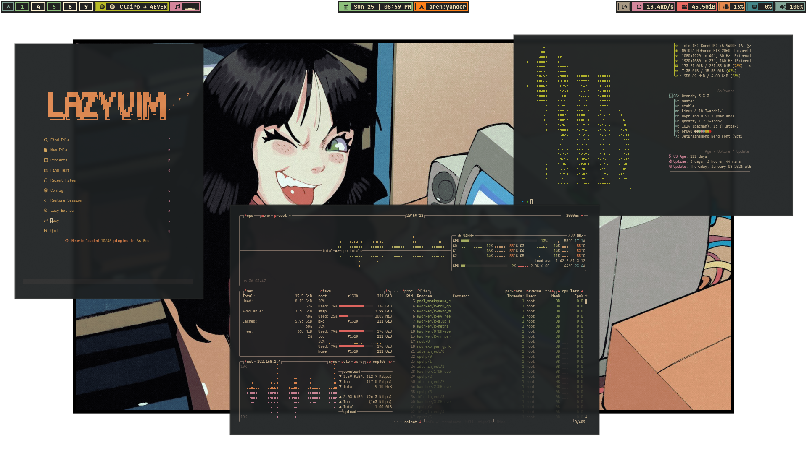
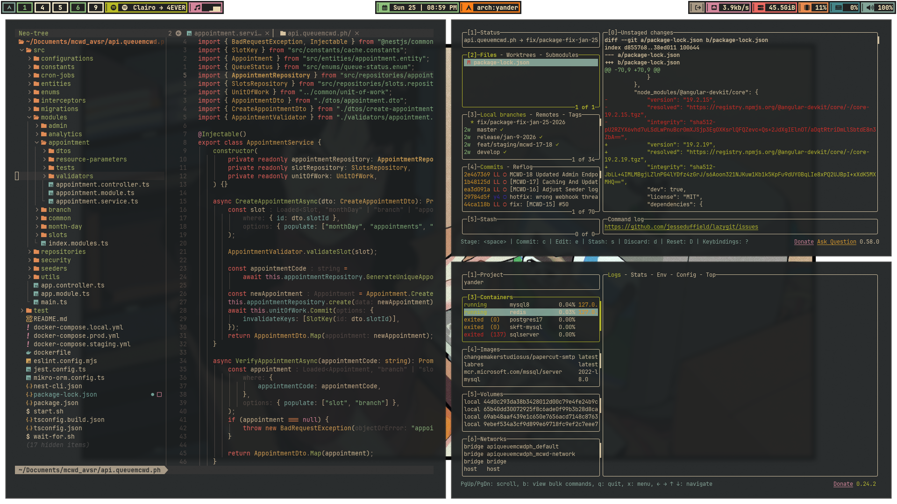

# Dotfiles

Personal configuration files managed with `chezmoi`.

## Overview

These configs focus on a clean, fast workflow and are optimized for **Omarchy**. If you are not using Omarchy, you may need to adjust paths, packages, or defaults to match your setup.

## Contents

- Shell, editor, and terminal settings
- Desktop and app configuration under `dot_config/`

## Screenshots

## Usage

- Initialize with `chezmoi init`
- Apply with `chezmoi apply`

## Notes

- Review configs before applying on a new machine

## Credits

Thanks to [ankur311sudo/gruvu](https://github.com/ankur311sudo/gruvu) for the theming inspiration and the Waybar base that I modified.

test commit bypass
