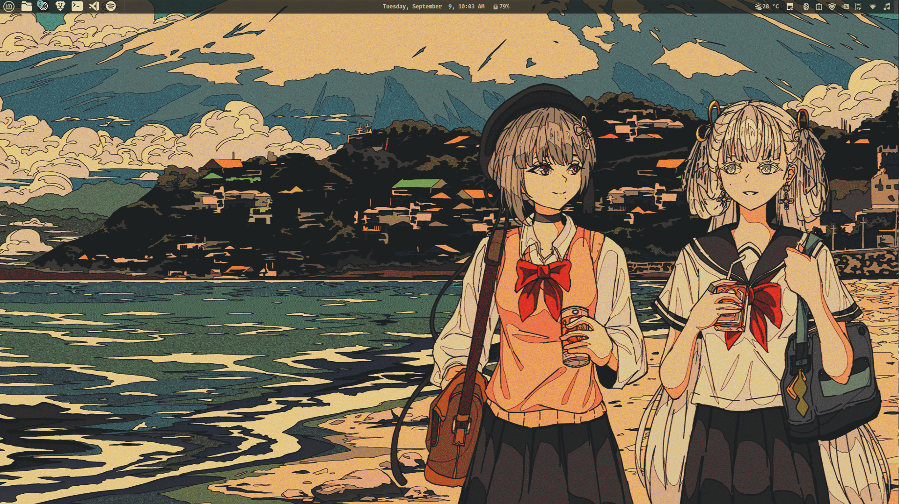
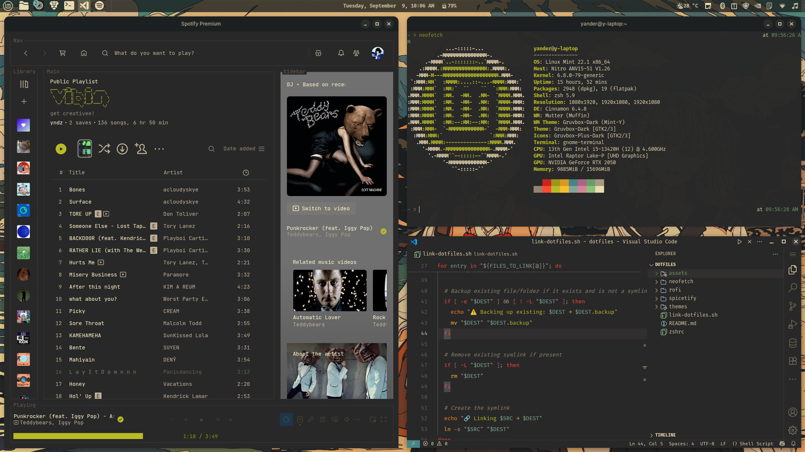

# YDotfiles Repository 🦸

This repository contains my personal configuration files (dotfiles) for Linux.  
It includes shell configs, terminal themes, and application configurations.  

Currently tracked configs:

- `zshrc` → `~/.zshrc` (Zsh shell config)
- `rofi/` → `~/.config/rofi` (Rofi launcher config)
- `spicetify/` → `~/.config/spicetify` (Spotify theming config)
- `neofetch/` → `~/.config/neofetch` (Neofetch system info theme)
- `themes/` -> `~/.config/themes` (My favorite theme which is gruvbox)

---

## Screenshots



---


## Setup Instructions

To set up your system with these dotfiles, follow these steps:

1. **Clone the repository**

```bash
git clone git@github.com:y4nder/ydotfiles.git
```

2. **Navigate to the repository**

```bash
cd ~/dotfiles
```

3. **Make the linking script executable**

```bash
chmod +x link-dotfiles.sh
```

4. **Run the linking script**

```bash
./link-dotfiles.sh
```

This script will:

* Create symlinks from your home directory to the files in this repository.
* Backup any existing files or directories that may conflict with the symlinks.
* Ensure all parent directories exist for the symlinks.

---

## Editing the Linked Files

If you want to add or remove files from being linked:

1. Open `link-dotfiles.sh`.
2. Edit the `FILES_TO_LINK` array with the format:

```
source_path:destination_path
```

For example:

```
"$HOME/dotfiles/gitconfig:$HOME/.gitconfig"
```

3. Save the file and re-run the script:

```bash
./link-dotfiles.sh
```